[linkedin](https://www.linkedin.com/in/vedik-gannoji/) &nbsp;·&nbsp;
[email](mailto:vedikgannoji5126@gmail.com)

> B.Tech CSE (Data Science) student from Hyderabad, India. 
> Small, sharp tools over big vague ideas.

I build fast, test on real users, and kill what doesn't work. Right now that's 
[Multi-Agent V2V Traffic Negotiation Framework](https://github.com/Vedikgannoji/multi-agent-traffic-negotiation-system) — a reinforcement learning framework where autonomous vehicles negotiate traffic cooperatively through V2V communication, reducing congestion and improving traffic flow. Also 
exploring machine learning, data science, and building AI-powered applications that solve practical problems.

<samp>python &nbsp; java &nbsp; sql &nbsp; react &nbsp; fastapi &nbsp; pandas &nbsp; scikit-learn &nbsp; mongodb &nbsp; mysql &nbsp; docker &nbsp; git &nbsp; linux</samp>

**[Multi-Agent V2V Traffic Negotiation Framework](https://github.com/Vedikgannoji/multi-agent-traffic-negotiation-system)** &nbsp;·&nbsp; <samp>python, reinforcement learning</samp> 
Reinforcement learning framework where autonomous vehicles negotiate traffic 
cooperatively through V2V communication, reducing congestion and improving traffic flow.

**[API Performance AutoTuner](https://github.com/Vedikgannoji/API-Performance-Auto-Tuner.git)** &nbsp;·&nbsp; <samp>node.js, express</samp> 
Self-monitoring backend system that tracks API performance, detects bottlenecks, 
and applies intelligent optimizations to improve response times automatically.

**[RoastMyStartup](https://github.com/Vedikgannoji/RoastMyStartup-main.git)** &nbsp;·&nbsp; <samp>react, ai</samp> 
AI-powered startup validation platform that delivers brutally honest feedback, 
competitive analysis, and actionable insights before ideas meet the real world.

**[Spawn](https://github.com/Abhiix0/Spawn)** &nbsp;·&nbsp; <samp>python, cli</samp> 
Contributed to a Python CLI that scaffolds production-ready projects with 
automated environments, dependencies, Git initialization, and modern tooling.

  

<picture>
  <source
    media="(prefers-color-scheme: dark)"
    srcset="https://raw.githubusercontent.com/Vedikgannoji/Vedikgannoji/output/github-contribution-grid-snake-dark.svg">
  <source
    media="(prefers-color-scheme: light)"
    srcset="https://raw.githubusercontent.com/Vedikgannoji/Vedikgannoji/output/github-contribution-grid-snake.svg">
  
</picture>

